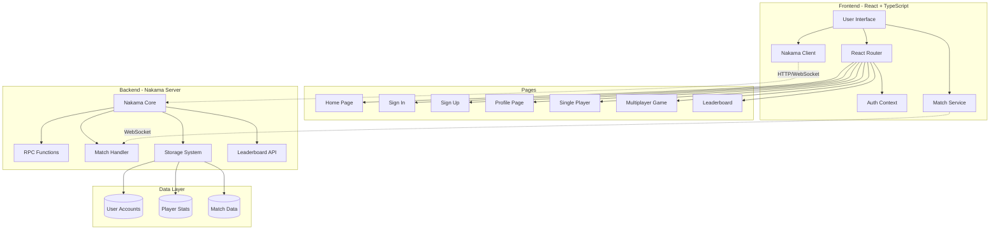
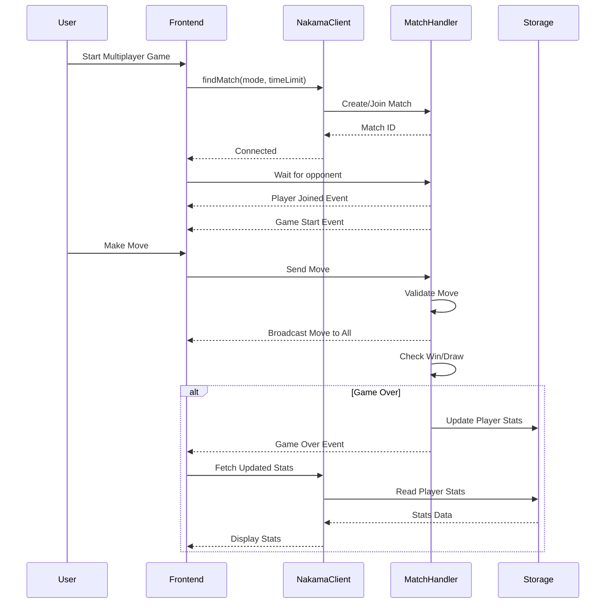

# Multiplayer Tic-Tac-Toe

A modern, real-time multiplayer Tic-Tac-Toe game built with React, TypeScript, and Nakama game server. Features user authentication, global leaderboards, player stats tracking, and both classic and timed game modes.

    

## Features

### Game Modes
- **Offline Game**: Play against your friend
- **Multiplayer**: Real-time online matches with other players
  - **Classic Mode**: Take your time, no rush
  - **⏱ Timed Mode**: Make moves within time limits (customizable: 10s, 15s, 30s)

### User Features
- **Authentication**: Email/password sign-up and sign-in
- **User Profiles**: Customizable avatars and country selection
- **Player Statistics**:
  - Total Score (± points based on wins/losses/draws)
  - Wins, Losses, Draws tracking
  - Current Win Streak
  - Best Win Streak ever achieved
  - Win Percentage calculation

### Leaderboard
- **Global Rankings**: Real-time leaderboard showing all players
- **Location Display**: See where players are from
- **Detailed Stats**: View Score, Wins, Losses, and Draws for all players
- **Auto Refresh**: Updates every 10 seconds
- **Storage-Based**: Fetches current scores directly from database

### Real-Time Features
- **Live Match Updates**: Instant move synchronization
- **Opponent Tracking**: See opponent's avatar, stats, and location
- **Turn Indicators**: Clear visual cues for whose turn it is
- **Timeout Handling**: Automatic forfeit on time expiration (timed mode)
- **Game Notifications**: Toast messages for game events

### Scoring System
- **Win**: +15 points, +1 win, streak continues
- **Loss**: -15 points, +1 loss, streak resets
- **Draw**: +7 points, +1 draw, streak resets
- **Minimum Score**: 0 (cannot go negative)

## Architecture

### System Architecture Diagram



graph LR
    subgraph "Core Services"
        NC[nakama-client.ts]
        MS[nakama-match.ts]
        AC[AuthContext]
    end
    
    subgraph "Game Components"
        Board[Board Component]
        PlayerCard[Player Card]
        MoveSummary[Move Summary]
        GameOver[Game Over Modal]
    end
    
    subgraph "Pages"
        MP[MultiplayerGame]
        PG[PlayGame]
        LB[Leaderboard]
        PR[Profile]
    end
    
    MP --> MS
    MP --> NC
    MP --> Board
    MP --> PlayerCard
    MP --> MoveSummary
    MP --> GameOver
    
    PG --> Board
    PG --> GameOver
    
    LB --> NC
    PR --> NC
    PR --> AC
    
    style Core Services fill:#FFE66D,stroke:#333
    style Game Components fill:#A8DADC,stroke:#333
    style Pages fill:#F1FAEE,stroke:#333
```

### Data Flow Diagram



## Technology Stack

### Frontend
- **React 19.2.0**: UI framework
- **TypeScript 5.9.3**: Type-safe JavaScript
- **TailwindCSS 4.1.17**: Utility-first CSS framework
- **React Router 7.9.6**: Client-side routing
- **React Hook Form 7.66.1**: Form validation
- **React Toastify 11.0.5**: Toast notifications
- **React Icons 5.5.0**: Icon library

### Backend
- **Nakama 3.24.1**: Open-source game server
- **JavaScript Runtime**: Server-side game logic
- **PostgreSQL**: Data persistence (via Nakama)
- **Docker**: Containerization

### Development Tools
- **ESLint**: Code linting
- **TypeScript ESLint**: TypeScript-specific linting
- **Vite Plugin React**: Fast refresh support

## Project Structure

```
tic-tac-toe/
├── nakama/                      # Nakama server configuration
│   ├── data/
│   │   └── modules/
│   │       └── index.js        # Game server logic (RPCs, Match Handler)
│   └── docker-compose.yml      # Docker setup
│
├── src/
│   ├── components/             # Reusable UI components
│   │   ├── Board.tsx          # Game board grid
│   │   ├── GameOverModal.tsx  # End game modal
│   │   ├── MoveSummary.tsx    # Move history display
│   │   └── PlayerCard.tsx     # Player info card
│   │
│   ├── context/
│   │   └── AuthContext.tsx    # Global auth state
│   │
│   ├── page/                   # Route pages
│   │   ├── auth/
│   │   │   ├── SignIn.tsx
│   │   │   └── SignUp.tsx
│   │   ├── Home.tsx
│   │   ├── Leaderboard.tsx
│   │   ├── MultiplayerGame.tsx
│   │   ├── PlayGame.tsx       # Single player
│   │   └── ProgilePage.tsx    # User profile
│   │
│   ├── services/
│   │   ├── nakama-client.ts   # Nakama SDK wrapper
│   │   └── nakama-match.ts    # Match service
│   │
│   ├── types/
│   │   └── types.ts           # TypeScript definitions
│   │
│   ├── utils/
│   │   ├── countries.ts       # Country data
│   │   └── game-logic.ts      # Game rules
│   │
│   ├── App.tsx                # Root component
│   └── main.tsx               # Entry point
│
├── package.json
├── tsconfig.json
├── vite.config.ts
└── README.md
```

## Getting Started

### Prerequisites
- Node.js (v18 or higher)
- npm or yarn
- Docker and Docker Compose

### Installation

1. **Clone the repository**
   ```bash
   git clone <repository-url>
   cd tic-tac-toe
   ```

2. **Install dependencies**
   ```bash
   npm install
   ```

3. **Start Nakama server**
   ```bash
   cd nakama
   docker-compose up -d
   ```
   
   The Nakama server will be available at:
   - Console: http://localhost:7351 (admin:password)
   - HTTP API: http://localhost:7350
   - gRPC: localhost:7349

4. **Start the development server**
   ```bash
   npm run dev
   ```
   
   The app will be available at http://localhost:5173

### Environment Configuration

The Nakama client is configured in `src/services/nakama-client.ts`:
- **Server**: localhost
- **Port**: 7350
- **SSL**: false (development)

## 🎯 Key Backend Functions (Nakama RPCs)

### Authentication & User Management
- `update_user_profile`: Update username, avatar, and location
- `get_user_account_by_id`: Fetch user account data

### Player Stats
- `get_player_stats`: Get current user's statistics
- `get_player_stats_by_id`: Get any player's statistics
- `update_player_stats`: Update stats after game completion

### Leaderboard
- `get_leaderboard`: Fetch sorted leaderboard from storage (limit: 100)

### Matchmaking
- `find_match`: Find or create a match with specified mode/time
- Real-time match handler manages game state, moves, and win detection

## Game Flow

### Offline Play:
1. Play game with friend
2. Stats not updated

### Multiplayer
1. User selects game mode (Classic / Timed)
2. Clicks "Find Match"
3. System searches for existing match or creates new one
4. Players join and game starts automatically
5. Real-time move synchronization via WebSocket
6. Backend validates moves and checks win conditions
7. On game end, stats are updated automatically
8. Players can view updated stats and leaderboard

## Database Schema

### User Accounts (Nakama Built-in)
```typescript
{
  user_id: string
  username: string
  email: string
  avatar_url: string
  location: string  // Country
  create_time: timestamp
  update_time: timestamp
}
```

### Player Stats (Custom Storage)
```typescript
Collection: "player_stats"
Key: "stats"
Value: {
  score: number
  wins: number
  losses: number
  draws: number
  winStreak: number
  bestWinStreak: number
}
```

## Authentication Flow

1. User signs up with email/password
2. Nakama creates account and returns session token
3. Session stored in localStorage as `logged_user`
4. AuthContext provides global auth state
5. Protected routes check authentication
6. Session auto-refreshes on expiration

## Testing

Run API tests:
```bash
npm run test:apis
```

## Build for Production

```bash
npm run build
```

Build output will be in the `dist/` directory.

##  Known Issues & Solutions

### Session Expiration
- Sessions auto-refresh when expired
- If refresh fails, user is redirected to sign-in

### Match Cleanup
- Matches clean up automatically after 5 minutes of player inactivity
- Players forfeit if they navigate away during an active game

### Leaderboard Sync
- Leaderboard updates in real-time by fetching from storage
- No manual sync required
- Auto-refreshes every 10 seconds

## Contributing

Contributions are welcome! Please follow these steps:

1. Fork the repository
2. Create a feature branch (`git checkout -b feature/AmazingFeature`)
3. Commit your changes (`git commit -m 'Add some AmazingFeature'`)
4. Push to the branch (`git push origin feature/AmazingFeature`)
5. Open a Pull Request

## License

This project is licensed under the MIT License.

## Acknowledgments

- [Heroic Labs](https://heroiclabs.com/) for Nakama game server
- [React Team](https://react.dev/) for the amazing framework
- [Tailwind Labs](https://tailwindcss.com/) for TailwindCSS
- [Vite Team](https://vitejs.dev/) for the blazing-fast build tool

## Contact

For questions or support, please open an issue on GitHub.

---
